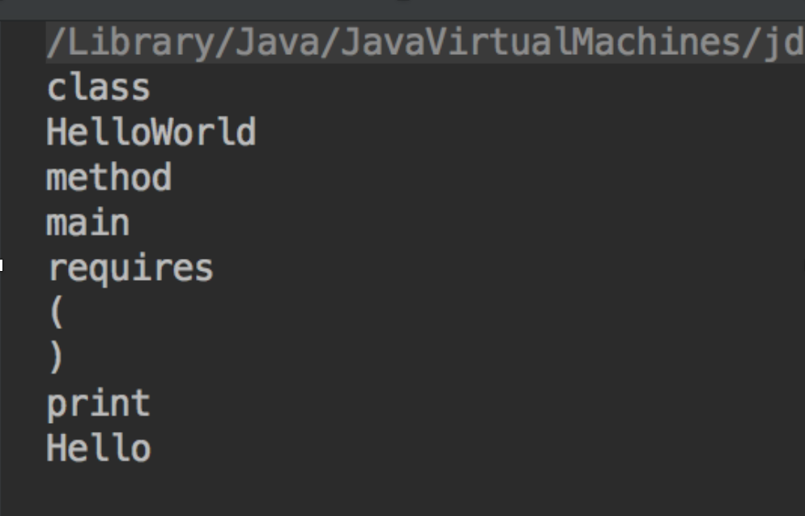

# Simple-Java-Compiler

A simple demonstration of a Java syntax like Cross compiler. Converts a java like syntax (semi-english code) into full java code. 

-----------

## Anatomy of a compiler

A basic complier consists of 3 main areas/tools that are needed for it to function as a fully fledged compiler. 

1.	A Lexical Analyser –The tokens are assigned an ID/token type that allows the parser (more on this later) to recognise what type of token it is and determines what needs to be done to it.
2.	A Parser – this is basically a tool used to determine the type of input that a particular token is and what needs to be done with it. 
3.	A Code Generator – this is the aspect of the compile that is most complicated to define, code is generated automatically that will be utilised by the compiler is some form or another. 

### Tokenizer / Lexical Analyser 

The tokenizer takes the lines of code within a file with the extension `.gh` and breaks them into individual tokens. 

This is broken up into parts. The main body of this comes in the form of the actual tokenizer class, this files contains all of the actual functions associated with breaking up a line of code into the individual tokens. 

Next is the TokData class, this determines the contents of an individual token and its properties, this is the basis of the parser. Then there is the TokType class, this determines the type of token that is presented such as a literal (integer, string, boolean etc), an operator, class, method etc. 

Finally is the Tok class, this is where each token is then passed after tokenizing and stored before final parsing.

An input stream is passed to the tokeniser, which breaks down the stream into individual tokens, according to criteria, it figures out what token type it is, then the data stored within that token such as its name, the method it contains, and its operators. This then checks what block it belongs to. 

The Block that a particular token can belong to is determined by checking where in the program it resides. So the main class definition is of block[0] meaning that it doesn't have anything above it. Next could be the method declaration in block[1], but the problem is ‘method’, is a sub block of class, so this is where the getSubBlks method comes in, as it states that if block[x] is within block 1 then it is a sub block of that block and is parsed to the required block tree.  



### Parser 

The parser is broken up unto four files:

- first is the main parser class
    - directs the tokens to their required destination.
- next is the variable parser
   - once the checking of the tokens has taken place would receive all tokens that are of type `variable`. It will then determine what type of variable a given token is, such as string, integer, float etc. This works via a series of regular expressions: 
   ```
   public boolean shouldParse(String line) {
    return line.matches("var [a-zA-Z]+ [a-zA-Z]+ = (\")?[a-zA-Z0-9]*(\")?");
    }
   ```
- this matches each line within a token block against its string literal in the Enum:
```
    EMPTY, //this is empty, absolutly nothing.
    TOKEN, //this repersents a token e.g. (), =, */, ", +, -"
    IDENTIFIER, // if first character is a letter, any proceeding characters are letters or numbers
    INTEGER_LITERAL, //a number like 0, 1,2,3,4,5 etc.
    FLOAT_LITERAL, // a IEEE floating point number such as 0.1, 0.02 or -1, -0.1, infinity, -infinity and NaN.
    STRING_LITERAL, // anything encloses in double quotes ""
```
It then checks against its builtInType:
```
public interface Type {

    public static Type match(String str) {
        try {
            return BuiltInType.valueOf(str.toUpperCase());
        }

        catch (Exception e) {
            // TODO: Match str to a class.
            return null;
        }
    }
}
```
```
/**
 * represents a type of veriable
 */
public enum BuiltInType implements Type {

    STRING, INTEGER, VOID, FLOAT
}
```

### Grammar: 

`<identifier>`
First character is a letter, or any proceeding characters are letters or numbers.

`<type>:`
A primitive type: string, int, char, float, double boolean.

`<value>:`
Either an identifier (for a variable) or a literal (1, "Hello", true)

Class Declaration:
`class <identifier>`

Method Declaration:
`'method <identifier = name> requires ([<type> <identifier = name>...]) returns <type>'`

Variable Declaration:
`'var <type> <identifier = name> [= <value>]'`

Method Invocation:
`'<identifier = name>([<value>...])'`

Print Statement:
`'Print <value>'`

Return Statement:
`'return <value>'`


**class variables**
```
method main requires() returns void
    var string str = getString()
    printString(str)
```
```
method printString requires(string str) returns void
    print str
```
```
method getString requires () returns string
    return str()
```

